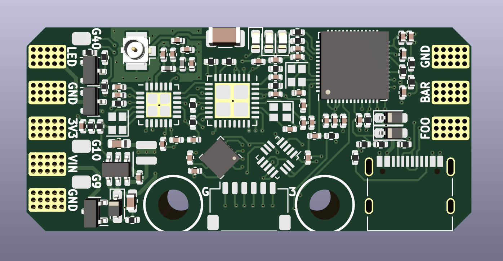
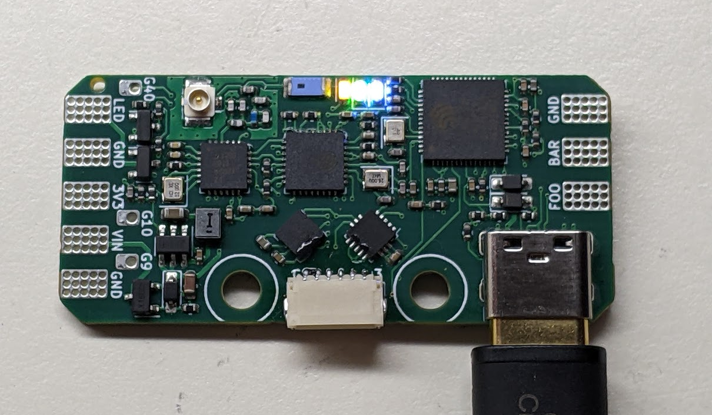

# Rotini V3 Overview

Rotini is an all-in-one meltybrain control board: power regulation, reverse-polarity protection, a switched high-voltage LED output, an ExpressLRS 2.4 GHz receiver, and inertial sensing on one 47 × 22 mm PCB. An ESP32-S2 runs the control loop using the [SimpleMelt](https://github.com/AlfredoSystems/SimpleMelt) Arduino library.

!!! note "This page documents Rotini V3"
    Facts below come from the V3 schematic and netlist as ordered in 2024. V4 (ESP32-S3) is a different board and will get its own pages.

## What is on the board

| Block | Part | Notes |
|---|---|---|
| Main MCU | ESP32-S2FH4 | 4 MB flash, no PSRAM, native USB |
| Receiver MCU | ESP8285H16 | Runs ExpressLRS firmware |
| Radio | SX1280 | 2.4 GHz LoRa, wired to the ESP8285 |
| Accelerometer | H3LIS331DL | ±400 g, SPI |
| Magnetometer | MMC5983MA | SPI |
| Regulator | SY8201CABC | 3.3 V buck, 1 A |
| Reverse polarity | AO3401A | P-channel FET on VIN |
| USB | USB-C receptacle | Data to the ESP32-S2, VBUS feeds VCC via a Schottky diode |

The two MCUs talk over a UART. The ESP32-S2 reads CRSF channel data from the receiver and sends battery telemetry back.

## Connectors and pads

### Solder pads

| Pad | Label | Function |
|---|---|---|
| J205 | VIN | Battery positive |
| J2, J6, J206 | GND | Battery negative, ESC signal ground |
| J207 | FOO | ESC signal output 1 (GPIO34) |
| J208 | BAR | ESC signal output 2 (GPIO35) |
| J4 | LED_HV | Switched battery voltage for the melty LED |
| J5 | 3V3 | Regulated 3.3 V output |
| J3 | Spare1 | GPIO9, unprotected |
| J7 | Spare2 | GPIO10, unprotected |
| J8 | Spare3 | GPIO40, unprotected |

### Boot header (J1, 6-pin JST-SH, 1.0 mm)

This header is how you flash the ESP8285 and how you force the ESP32-S2 into download mode.

| Pin | Net | Function |
|---|---|---|
| 1 | GND | Ground |
| 2 | ELRS_BOOT | ESP8285 GPIO0. Short to GND at power-up to enter download mode |
| 3 | ELRS_RX | ESP8285 UART receive. Connect to your adapter's TX |
| 4 | ELRS_TX | ESP8285 UART transmit. Connect to your adapter's RX |
| 5 | S2_BOOT | ESP32-S2 GPIO0. Short to GND at power-up to enter download mode |
| 6 | 3V3 | 3.3 V rail. Can power the board from a UART adapter |

### Test pads

| Pad | Net |
|---|---|
| TP1 | ELRS_TX |
| TP2 | ELRS_RX |
| TP3 | GND |
| TP4 | S2_BOOT |
| TP5 | S2_EN (ESP32-S2 reset, ground to hold the S2 in reset) |
| TP7 | ELRS_BOOT |

### Antenna

The SX1280 RF output goes to both a U.FL connector (J60) and a 2.4 GHz chip antenna (J61). The ESP8285 has its own PCB trace antenna for WiFi updates.

## GPIO map (ESP32-S2)

These match the pin constants in the SimpleMelt `Rotini-Example` sketch.

| Function | GPIO | Notes |
|---|---|---|
| BOOT | 0 | J1 pin 5, TP4 |
| SPI MISO | 1 | Shared by accelerometer and magnetometer |
| Magnetometer CS | 2 | |
| VIN sense | 3 | ADC, through a 15 kΩ / 2.2 kΩ divider |
| Board version sense | 5 | ADC, 5.1 kΩ / 3.3 kΩ divider, about 1.3 V on V3 |
| CRSF RX | 7 | Data from the receiver (net ELRS_TX) |
| CRSF TX | 8 | Data to the receiver (net ELRS_RX) |
| Spare1 | 9 | J3 |
| Spare2 | 10 | J7 |
| Accelerometer CS | 11 | |
| Accelerometer INT | 12 | |
| Magnetometer INT | 13 | |
| SPI MOSI | 14 | |
| SPI SCK | 17 | |
| USB D− / D+ | 19 / 20 | USB-C |
| Motor FOO | 34 | Through 100 Ω and an ESD diode to pad J207 |
| Motor BAR | 35 | Through 100 Ω and an ESD diode to pad J208 |
| Spare3 | 40 | J8 |
| Status LED | 41 | Green LED, active high |
| Melty LED | 42 | Drives the LED_HV switch, active high |

GPIO18 has a pull-up but is otherwise unused. UART0 (GPIO43/44) is not broken out.

## Onboard LEDs

| LED | Colour | Meaning |
|---|---|---|
| D40 | Blue | 3.3 V rail is up |
| D41 | Green | Status, driven by ESP32-S2 GPIO41 |
| D60 | Yellow | ExpressLRS status, driven by ESP8285 GPIO16 |

## Power

### Input

| Parameter | Value | Set by |
|---|---|---|
| Minimum VIN | 4.5 V | SY8201 minimum input |
| Maximum VIN | 27 V | SY8201 absolute maximum |
| Reverse polarity | Protected | AO3401A P-FET, rated 30 V |
| Practical batteries | 2S to 6S LiPo | A charged 6S pack is 25.2 V, leaving little margin |

!!! warning "No transient protection on V3"
    There is no TVS diode on VIN. Voltage spikes from ESC braking add to the pack voltage. On 6S you are already close to the regulator's limit, so treat 6S as the ceiling and prefer 4S when you can.

### USB power

VBUS feeds VCC through a 1N5819 Schottky diode. The board runs from USB alone, so you can program and test with no battery connected. The diode also stops the battery from back-feeding the USB port.

### 3.3 V rail

The SY8201 buck converter supplies up to 1 A total. The ESP32-S2, ESP8285, SX1280 and sensors share it, so leave the bulk of that for the board and keep external loads on the 3V3 pad to a couple hundred milliamps.

### LED_HV output

LED_HV is battery voltage switched by a high-side P-channel FET (LBSS84). It turns on when the ESP32-S2 drives GPIO42 high.

| Parameter | Value |
|---|---|
| Output voltage | VCC (battery voltage minus the reverse-polarity FET drop) |
| Continuous current | 130 mA maximum |
| Current limiting | None on the board |

Size a series resistor for your LED at your pack voltage, or use an LED module rated for the pack voltage. Exceeding 130 mA will damage the FET.

### ESC outputs

FOO and BAR are 3.3 V logic outputs with a 100 Ω series resistor and an ESD clamp. SimpleMelt drives them with OneShot125 at 400 Hz. Connect ESC signal to the pad and ESC signal ground to a GND pad.

### Battery voltage sensing

VIN is divided by 15 kΩ / 2.2 kΩ onto GPIO3, a ratio of about 7.8. The example sketch multiplies by 8.21, which was calibrated on real boards. The ADC tops out near 3.1 V, which corresponds to about 24 V of pack voltage.
